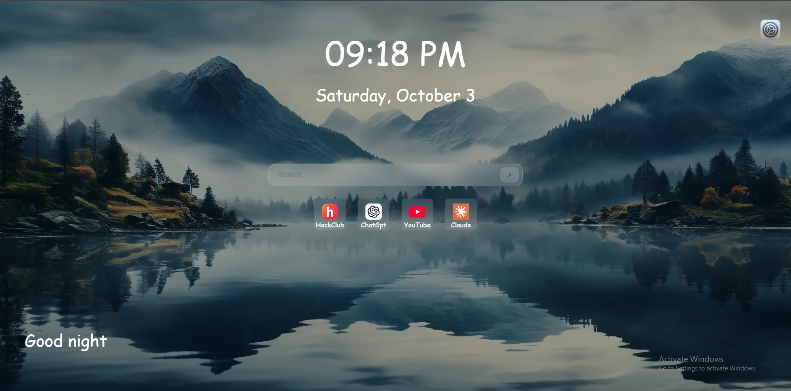
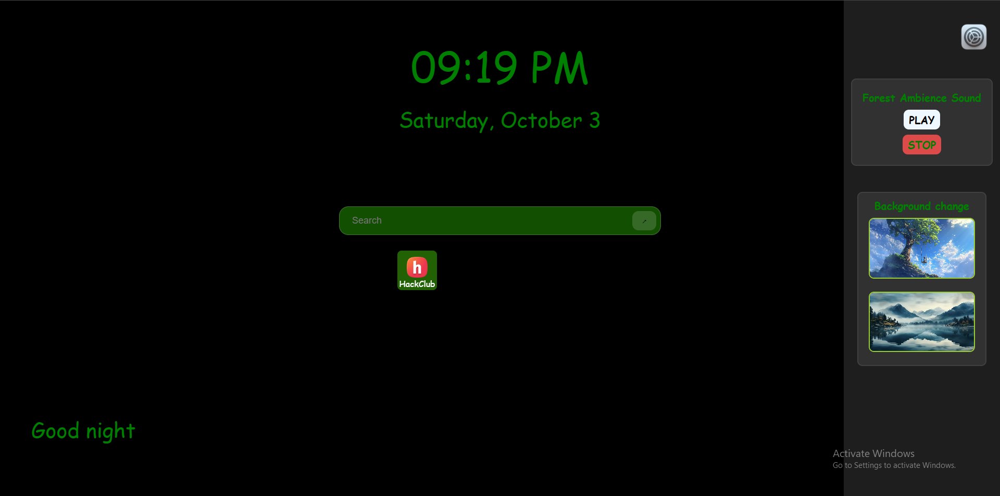

# WildTab

Here I am introducing WildTab, a wild new tab page with a nature-inspired design.

I was inspired by Wallsflow's new tab page, especially its clean nature-focused visuals, and wanted to create something with a similar feeling while building my own version from scratch.

WildTab is built using HTML, CSS, and JavaScript. It is a small and simple project designed to make the browser's new tab page feel more relaxing and connected to nature.


## Live Demo

[Open the live website](https://raphelreji.github.io/Builder-Signal/)

## Screenshots




## Features

- Nature-inspired interactive design
- Search bar
- Real-time date and clock
- Time-based greetings
- Changeable backgrounds
- Background music
- Hidden easter egg
- Responsive layout
- Simple and lightweight design

## Installation to run locally

1. Clone this repository:
```bash
git clone https://github.com/RaphelReji/Builder-Signal.git
```
Repository url:
```bash
git clone https://github.com/RaphelReji/Builder-Signal
```

2. Open the project folder in VS Code or any code editor.

3. Open `index.html` in your browser.

No server or additional dependencies are required.

### How It Works
You want to explore through your new tab, change background play music and find the easter egg hidden

## Design

A nature themed newtab with  hidden green effects

## What I Learned
- A lot of things like the search bar concept

## Credits 
 - The background video was inspired by and taken from Wallsflow and is used for non-commercial purposes.
 - icons:Taken from icon8
 - The overall concept was inspired by nature-themed new tab experiences such as Wallsflow, while the project itself was built as my own implementation.

 ## License

This project was created under MIT-do what ever with it.
